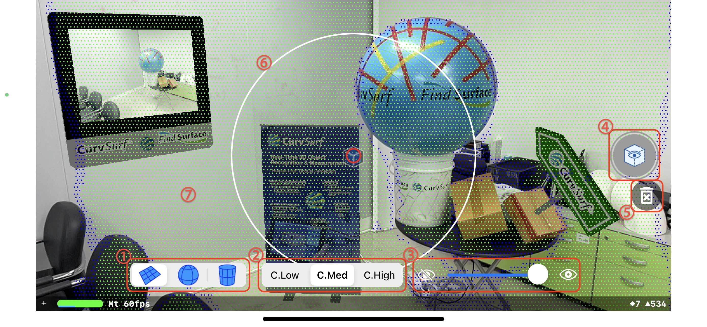

# FindSurface-SceneKit-ARDemo-iOS (Swift)

**Curv*Surf* FindSurface™** ARSceneKitDemo for iOS (Swift)

## Overview

This demo app demonstrates a real-time AR SceneKit application using FindSurface to search point clouds, which ARKit provides, for geometry shapes. The source code of this app is based on the Xcode Augmented Reality (SceneKit, iOS) template project. 

[FindSurfaceFramework](https://github.com/CurvSurf/FindSurface-iOS) is required to build the source code into a program. Download the framework [here](https://github.com/CurvSurf/FindSurface-iOS/releases) and refer to [here](https://github.com/CurvSurf/FindSurface-iOS/blob/master/How-to-import-FindSurface-Framework-to-your-project.md) for an instruction about how to setup your project to build it with the framework.

## Requirements

This demo app requires the LiDAR sensor to get a point cloud from ARKit.

- Apple iPad Pro LiDAR
- Apple iPhone 12 Pro
- Apple iPhone 12 Pro Max
- Apple iPhone 13 Pro
- Apple iPhone 13 Pro Max

## Features

Compared to the [gui demo](https://github.com/CurvSurf/FindSurface-GUIDemo-iOS), this demo has the following differences:

- Rendering AR objects and animations around detected geometry surfaces;
- The code related to AR object rendering uses SceneKit framework.

## User Interface

> The following descriptions start from the lower-left corner of the picture above and proceed counterclockwise.
1. [Feature types](https://github.com/CurvSurf/FindSurface#auto-detection) of surfaces to detect (plane/sphere/cylinder only).
2. Confidence levels to filter point cloud (e.g., the "`C.Med`" option means filtering out the points having "low" confidence).
3. The opacity of the point cloud and radius indicators.
4. Invoke FindSurface to search for geometric surfaces and place a virtual object on the surface if found.
5. Remove all the virtual objects
6. Radius indicators.
    - The [seed radius](https://github.com/CurvSurf/FindSurface#how-does-it-work) indicator (the white circle) is controlled by pinching the screen.
    - The picking radius indicator (the red circle) is controlled by dragging the screen vertically.
    - The focusing point (the blue box) indicates the aim of the target object, to choose a [seed point](https://github.com/CurvSurf/FindSurface#how-does-it-work).
7. Points shown on the screen are the visualization of the points provided by ARKit, of which colors indicate confidence levels (green, blue, and red mean high, medium, and low, respectively).

## Output Examples

**AR scene without pointcloud**

The list of the virtual objects and the places to find them are as follows:

| Geometry | Description |
|:--------:|:------------|
| Plane (vertical) | A television displaying the camera stream. |
| Plane (horizontal) | CurvSurf's pull-up banner. |
| Plane (sloped) | A directional sign with the CurvSurf logo. |
| Sphere & Cylinder | An animation effect that makes the FindSurface logo go around along the circumference of the surface. | 

**The original scene**

